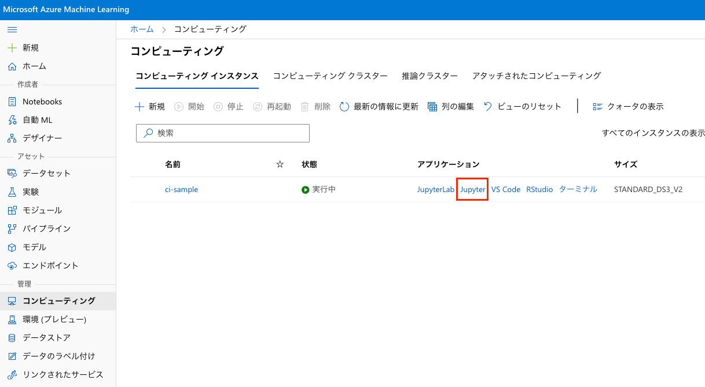

# azure-ml-python-handson
[Deep Learning Lab](https://dllab.connpass.com/) が主宰する Azure Machine Learning のハンズオンシリーズというイベントで使用された学習コンテンツです。
シリーズの第二回目となる、[Python による機械学習入門](https://dllab.connpass.com/event/214093/)の学習教材です。投影資料等のリンクはイベントページからご確認ください。

学習コンテンツは、Microsoft から公開されている MSLEARN-DP100(参考3) をベースに、Python によるモデルの学習、デプロイを日本語で作成しています。

## 目的
機械学習における一連の流れを体験していただくため、Visual Studio Code に触れ、Azure Machine Learning の学習からデプロイまでを動かしていただきます。

以下の手順でモジュールが構成されており、 *Notebook* が開ける環境で実行してください。

1. Visual Studio Code 入門
1. Python と scikit-learn のモデル学習とチューニング
1. 様々な環境へのデプロイ

## 準備
この教材を簡単に動かす手順例です。
1. Azure のワークスペースを用意
    1. Azure Portal からリソースグループを開き [作成]
    1. リソースグループを開いてリソースの [作成]
    1. カテゴリ [AI + Machine Learning] を選ぶ
    1. [Machine Learning] を [作成]
    1. 作成したサービスを開き [スタジオの起動]
1. コンピューティングインスタンスを作成
    1. Azure Machine Learning Studio で以下の手順を実行
    1. [管理]→[コンピューティング]→[コンピューティングインスタンス]に移動
    1. [新規] からコンピューティングインスタンスを作成
    1. インスタンスが作成されると、一覧の [アプリケーション] に [Jupyter] が出現するので押下

## 参考
1. [Visual Studio Code](https://code.visualstudio.com/)
1. [Visual Studio Code を使用して Python 初心者向けの開発環境をセットアップする](https://docs.microsoft.com/ja-jp/learn/modules/python-install-vscode/)
1. [MSLEARN-DP100](https://microsoftlearning.github.io/mslearn-dp100/)
1. [Azure Portal](https://ms.portal.azure.com/)
1. [scikit-learn.org](https://scikit-learn.org/)